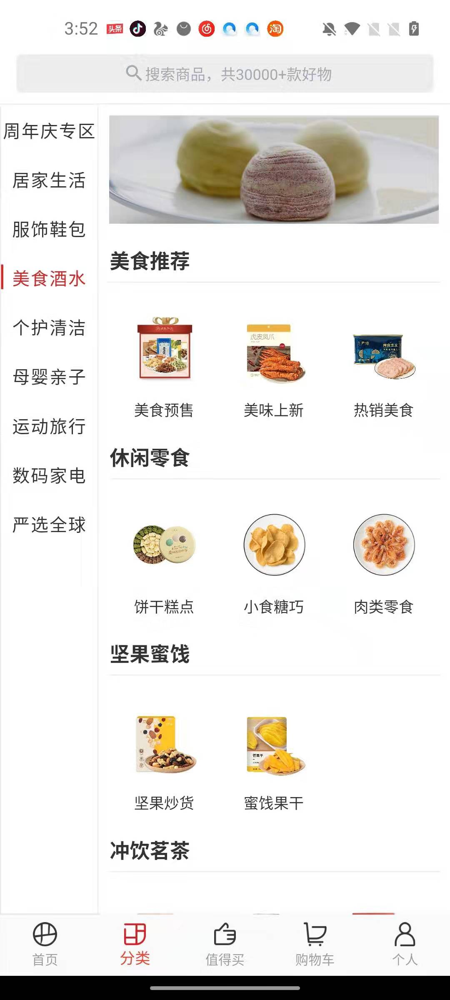
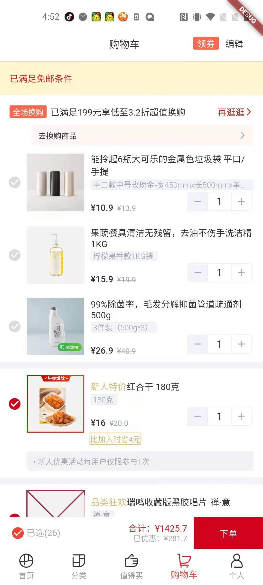
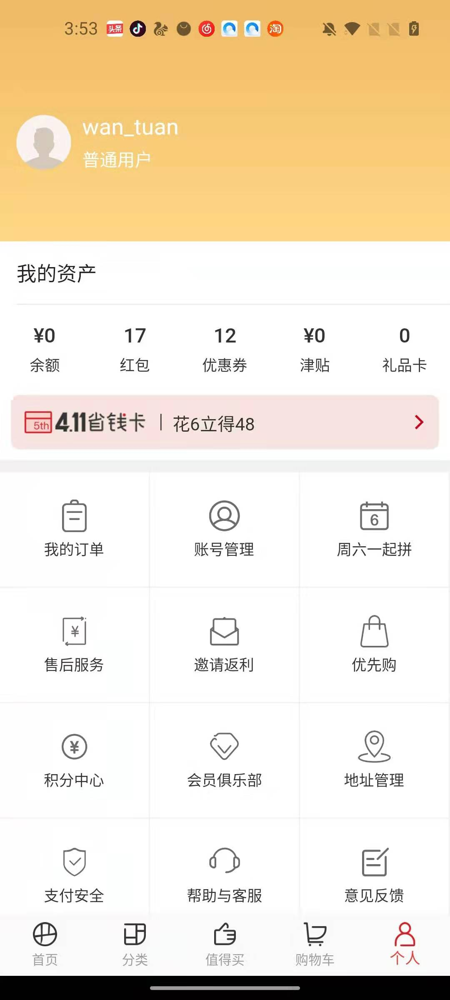
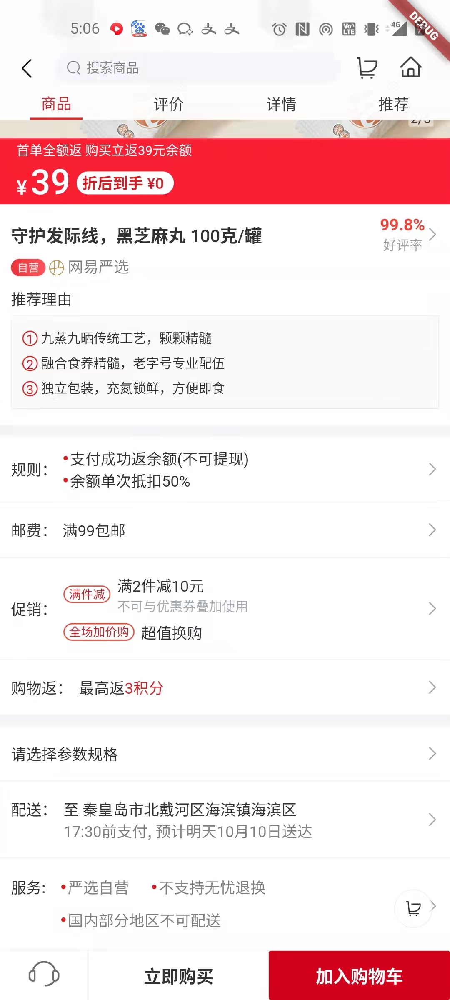
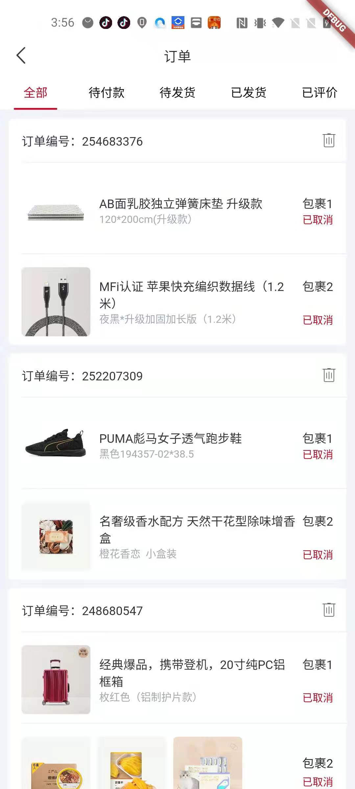

### [Demo.apk下载地址](http://d.maps9.com/7c8n) 
如无法直接打开，请复制 http://d.maps9.com/7c8n 到浏览器打开

## 
#### 已实现登录功能，动态获取cookie。感谢 [Tdreamy](https://github.com/Tdreamy) 提供的思路以及对ios插件的支持，以及优化
#### 新增支持Null-safety

## 注意
#### 注意项目中使用的kotlin,gradle版本
#### cookie已实现动态更新
#### jdk最低支持11

## 深度还原网易严选web-app
1. 首页,值得买,分类,购物车,我的,搜索,商品详情,拼团,年购等等，都已实现（除了下单之后的逻辑）
2. 登录功能已实现,网页登录即可

## Screenshots
|         首页         |        分类         |         值得买         |         购物车         |
| :------------------: | :-------------------: | :----------------------: | :----------------------: |
|  |  |  |  |

|         个人          |        商品详情        |         添加购物车        |          订单           |
| :-------------------: | :-------------------------: | :----------------------------: | :-------------------------: |
|  |  |  |  |

## 主要功能点
- 网络请求封装，返回数据实例化模型
- flutter与原生的交互
- 常见的安卓Material Design风格
- 组件封装
- 纯属学习项目，数据全部来源于网易严选Web端,切勿涉及违法行为
- 数据来之不易，如有帮助，请帮忙点个👍

## 使用的一些库
- [Flutter中文网](https://flutterchina.club/)
- [Dio](https://pub.flutter-io.cn/packages/dio)
- [json_annotation](https://pub.flutter-io.cn/packages/json_annotation)
- [webview_flutter](https://pub.flutter-io.cn/packages/webview_flutter)
- [cached_network_image](https://pub.flutter-io.cn/packages/cached_network_image)
- [flutter_swiper](https://pub.flutter-io.cn/packages/flutter_swiper)
- [json_annotation](https://pub.flutter-io.cn/packages?q=json_annotation)

##
我的邮箱 wan_tuan@163.com
